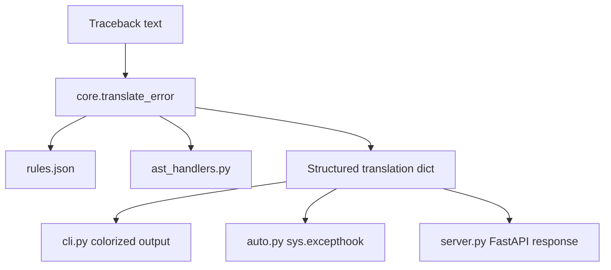

# System Architecture

This repository contains a single Python translation engine and a set of thin entry points around it. The runtime flow is intentionally simple: parse a traceback, match the final error line against the rule database, enrich the result with traceback context, and present the translation through the CLI, import hook, or HTTP API.

## High-level flow

## Runtime modules

| Component | Responsibility |
|-----------|----------------|
| `error_translator/core.py` | Loads `rules.json`, parses the traceback text, extracts the file name, line number, and code context, and returns the translation dictionary. |
| `error_translator/cli.py` | Implements the `explain-error` command. It supports raw traceback strings, piped input, and `run <script.py>` execution. |
| `error_translator/auto.py` | Replaces `sys.excepthook` so unhandled Python exceptions are translated automatically when the module is imported. |
| `error_translator/server.py` | Exposes the FastAPI app with `GET /` and `POST /translate`. |
| `error_translator/ast_handlers.py` | Provides optional contextual handlers for some error families such as `NameError`, `AttributeError`, and `ImportError`. |
| `error_translator/rules.json` | Stores the regex patterns, explanations, fixes, and default fallback message. |

## Supporting files

| Component | Responsibility |
|-----------|----------------|
| `builder.py` | Optional rule-authoring helper that asks Gemini to draft new regex rules from the scraped error dataset. It requires `GEMINI_API_KEY`. |
| `scraper.py` | Refreshes `scraped_errors_database.json` by reading the Python exception documentation from docs.python.org. |
| `typo.py` | Small sample script used to demonstrate the automatic import hook during development. |
| `tests/test_core.py` | Regression coverage for the translation pipeline and traceback parsing. |

## Translation steps

1. Read the traceback text.
2. Use the last non-empty line as the error line to match.
3. Extract the file and line number from the traceback when present.
4. Load `rules.json` and evaluate the regex rules in order.
5. Format the explanation and fix with any captured values.
6. Pull a source line from disk when the file and line are available.
7. Ask `ast_handlers.AST_REGISTRY` for an additional insight when a matching handler exists.
8. Return a dictionary that the CLI, import hook, and API can render consistently.

## Output contract

`translate_error()` returns a Python dictionary with a stable shape so every front end can reuse the same engine without extra translation work. The most important fields are `explanation`, `fix`, `matched_error`, `file`, `line`, and `code`; `ast_insight` is included when a handler produces one.

## Packaging

The package is exposed through `pyproject.toml` as the `explain-error` console script. There is no separate VS Code extension in this repository; the distributed package here is the Python CLI and API engine itself.